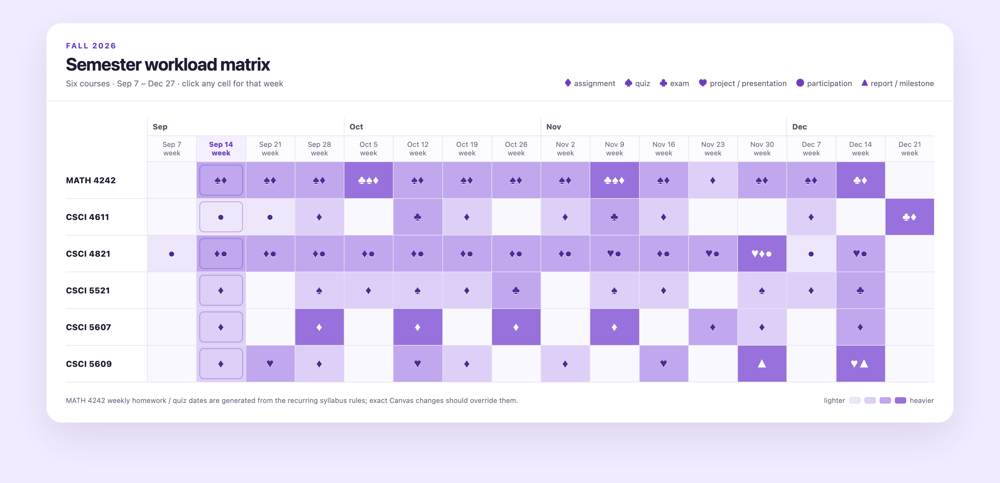
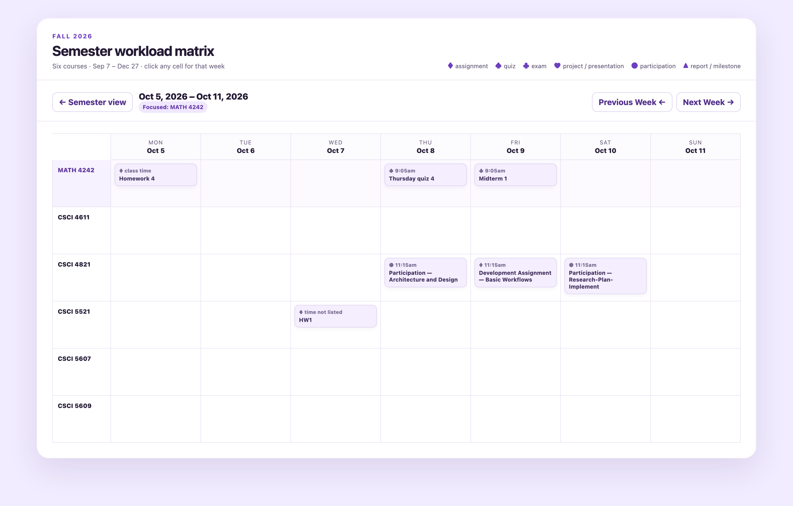

<div align="center">



# Awesome Calendar Skill

**One skill file. Every course, every week, on one page.**

Give any LLM your syllabus PDFs, schedule pages and grade tables.<br>
Get back a single self-contained HTML calendar you can actually use all semester.

[](https://kenny2077.github.io/Awesome-calendar-skill/)
[](skills/semester-matrix/SKILL.md)
[](examples/fall-2026-demo.html)
[](#no-build-no-server-no-account)
[](LICENSE)

**[Live demo](https://kenny2077.github.io/Awesome-calendar-skill/)** ·
[Quick start](#quick-start) ·
[How it works](#how-it-works) ·
[Compatibility](#compatibility) ·
[FAQ](#faq)

</div>

---

## Quick start

The skill is one Markdown file. There is nothing to install and nothing to run.

### In a chat client

<sub>ChatGPT · Claude · Gemini · any model that reads files</sub>

1. Open **[`skills/semester-matrix/SKILL.md`](skills/semester-matrix/SKILL.md)** and copy the whole file.
2. Paste it into a new conversation.
3. Attach your course material — syllabus PDFs, schedule pages, Canvas grade tables,
   screenshots, pasted text. Mixed formats are fine. Messy is fine.
4. Ask for the semester matrix.
5. Save the HTML it returns and open it in any browser.

### In a coding agent

<sub>Claude Code · Codex · opencode · Cursor</sub>

```bash
mkdir -p ~/.claude/skills/semester-matrix
curl -fsSL https://raw.githubusercontent.com/kenny2077/Awesome-calendar-skill/main/skills/semester-matrix/SKILL.md \
  -o ~/.claude/skills/semester-matrix/SKILL.md
```

Then point the agent at your syllabus folder and ask for the semester matrix. Agents
can render and inspect the page themselves, so the self-check runs before you ever
see the result.

> For an agent that loads skills from somewhere else, put `SKILL.md` in that
> directory instead — the file carries no tool-specific instructions.

### Clone the whole repo

```bash
git clone https://github.com/kenny2077/Awesome-calendar-skill.git
open Awesome-calendar-skill/examples/fall-2026-demo.html
```

---

## What you get

Two layers, one file. The semester view opens first; every cell is a door into its week.

| | |
| --- | --- |
| **Semester view** | Every course × every calendar week. Colour intensity is workload, so crunch weeks are visible a month out. |
| **Weekly view** | Click any cell. Courses become lanes, days become columns, every item carries its due time. |
| **Hover** | Detail appears beside the cursor. No side panels, no expanding rows, no clutter. |

<div align="center">

</div>

### Notation

Matrix cells carry marks and no text, which is what keeps a sixteen-week grid readable.

| Mark | Meaning | Mark | Meaning |
| :-: | --- | :-: | --- |
| ♦ | assignment | ● | participation |
| ♠ | quiz | ♥ | project or presentation |
| ♣ | exam | ▲ | report or milestone |

Marks combine when a week holds more than one kind of work, and the depth of colour
tracks how much that week is carrying.

### No build, no server, no account

Everything the page needs is inline. It opens in Chrome, Safari, Firefox, Edge and the
VS Code built-in browser. Nothing is uploaded anywhere and nothing phones home — the
file is yours, and it works offline.

---

## How it works

The skill is a specification, not a script. It tells the model what to build and how to
check its own work:

```text
syllabi, schedules, grade pages
          ↓  normalize        pull out course, item, type, date, time
          ↓  infer            expand recurring syllabus rules, flag TBD timing
          ↓  render           course × week matrix, then the weekly detail layer
          ↓  inspect          score the render 1–10 on simplicity and grid readability
          ↓  repeat           below 8, fix in one batched pass and re-render
      one self-contained .html
```

That inspection loop is the reason the first output is usually the one you keep. Most
prompts hand you a broken grid and leave you to describe the breakage; this one makes
the model look before it ships.

Inferred dates are marked **TBD** in the output, so a date read out of a syllabus rule
never masquerades as one the instructor actually published.

---

## Compatibility

| Model | Mode | Result |
| --- | --- | --- |
| GPT‑5.6 Thinking (high) | Chat | Clean one-shot render, five for five |
| GPT‑5.6 | Chat, free tier | Usable one-shot render, slightly less polished |
| Claude Code · Codex | Agent | Works, with live preview and a real inspection pass |

The skill is model-agnostic by design: it specifies structure, layers and acceptance
criteria rather than a toolchain. The demo in this repo is an unedited one-shot output.

---

## Repository layout

```text
.
├── skills/semester-matrix/SKILL.md   the skill — this is the whole product
├── examples/fall-2026-demo.html      a real one-shot output, unedited
├── docs/assets/                      screenshots and the social card
├── index.html                        the live demo page (GitHub Pages)
└── CONTRIBUTING.md                   how to propose changes to the skill
```

---

## FAQ

<details>
<summary><b>Why not just use Canvas?</b></summary><br>

Canvas gives you a list per course and no cross-course view. Checking six courses for
due dates, by hand, every week, all term is the problem this exists to remove.
</details>

<details>
<summary><b>Why not put everything in Google Calendar?</b></summary><br>

Entering a semester of deadlines by hand costs an evening you do not have. And a
calendar is built for appointments — it will never show you that week 9 holds three
exams and a project milestone.
</details>

<details>
<summary><b>Why not a Canvas browser extension?</b></summary><br>

Extensions can only import what is actually in Canvas. Instructors routinely keep the
real schedule in a PDF, bury a deadline in the grading policy, or post a revised date
in an announcement. A language model reads all of those the way you would.
</details>

<details>
<summary><b>Why HTML instead of a PDF or a notebook?</b></summary><br>

A PDF cannot hover, drill down or walk between weeks. A notebook needs a kernel and an
environment. An HTML file needs a browser, which every student already has.
</details>

<details>
<summary><b>A date is wrong, or a course changed its schedule.</b></summary><br>

Re-run the skill with the updated material, or open the HTML and edit the event data
near the bottom of the file. Canvas should always win over a syllabus-inferred date;
the page marks inferred timings as TBD so you can tell the two apart at a glance.
</details>

---

## Contributing

Issues and pull requests are welcome — see **[CONTRIBUTING.md](CONTRIBUTING.md)** for
the ground rules on editing a tuned prompt, and for the commit convention this repo
follows.

The most useful contribution is a render from a model that is not yet in the
compatibility table, especially one that came out badly.

## License

[MIT](LICENSE) © [kenny2077](https://github.com/kenny2077)

<sub>Also from me — [Aurora Digest](https://github.com/kenny2077/Aurora-Digest) ·
[Aurora Forge](https://github.com/kenny2077/Aurora-Forge) ·
[Aurora Survival](https://github.com/kenny2077/Aurora-Survival)</sub>
