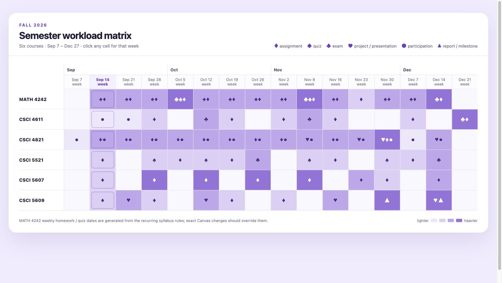
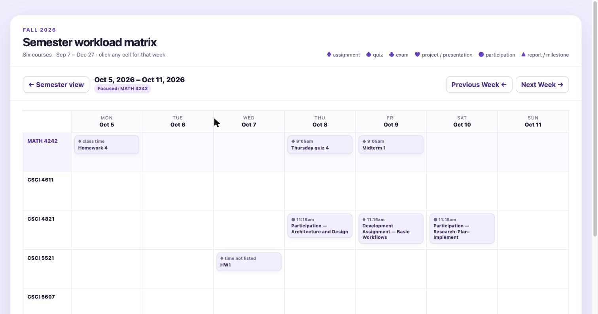

# Uni Student Awesome Calendar Skill

**A one-shot skill that turns messy syllabi into a beautiful, interactive semester schedule.**

Paste the skill into your favorite LLM, drop in your syllabus PDFs, schedule pages,
and grade tables — get back a single self-contained HTML file that shows your whole
semester as a course × week workload matrix, with a weekly view one click away.

### [→ Live demo](https://kenny2077.github.io/Uni-student-awesome-calendar-skill/)

Hover a cell. Click a cell. Nothing to install.

 

## Why this exists

Every semester starts the same way: six courses, six different places where the due
dates actually live. One professor keeps everything in Canvas. One posts a schedule
PDF and a separate syllabus PDF. One hides the real deadlines in the grading section.
Canvas shows you a list; it never shows you *the shape of your semester*.

So you end up checking Canvas over and over, one course at a time, all term.

This skill replaces all of that with a single page you actually want to open:

| | |
| --- | --- |
| **Semester view** | Every course × every calendar week. Purple intensity = workload. You see crunch weeks a month before they hit. |
| **Weekly view** | Click any cell. Courses as lanes, days as columns, every due item with its time. |
| **Hover** | Details appear next to the cursor. No extra panels, no clutter. |

## Quickstart

1. Open [`skills/semester-matrix/SKILL.md`](skills/semester-matrix/SKILL.md) and copy the whole file.
2. Paste it into your LLM of choice (ChatGPT, Claude, Claude Code, Codex, …).
3. Attach or paste your course material — syllabus PDFs, schedule pages, Canvas grade
   tables, screenshots, plain text. Messy is fine; mixed formats are fine.
4. Ask for the semester matrix.
5. Save the HTML it produces and open it in any browser.

If you use a coding agent (Claude Code, Codex), drop the file into your skills
directory instead and let the agent build and preview the page for you.

> The skill ends with a self-inspection loop: the model scores its own render 1–10 on
> simplicity and grid readability and re-renders until it passes 8. That loop is the
> reason the first output is usually the one you keep.

## The output

A single `.html` file. No build step, no server, no `node_modules`, no notebook kernel.

### Symbols

The matrix cells carry no text — only marks, so the grid stays readable at a glance.

| Mark | Meaning |
| --- | --- |
| ♦ | assignment |
| ♠ | quiz |
| ♣ | exam |
| ♥ | project / presentation |
| ● | participation |
| ▲ | report / milestone |

Cells combine marks when a week holds more than one kind of work, and the purple
intensity of the cell tracks how much is due that week.

### No dependencies

Everything the page needs is inline. It opens in Chrome, Safari, Firefox, Edge, and
the VS Code built-in browser. Nothing is uploaded anywhere; the file is yours.

## Tested on

| Model | Result |
| --- | --- |
| GPT‑5.6 Thinking (high), Plus | Clean one-shot render, five for five |
| GPT‑5.6, free tier | Usable one-shot render; slightly less polished |
| Claude Code / Codex (agent mode) | Works, with live preview and self-inspection |

The skill is model-agnostic by design — it specifies structure, layers, and
inspection criteria rather than a particular toolchain.

## Try it first

The [live demo](https://kenny2077.github.io/Uni-student-awesome-calendar-skill/) runs
the real thing in your browser — hover a cell, click a cell, walk the weeks.

It is rendering [`examples/fall-2026-demo.html`](examples/fall-2026-demo.html), an
actual one-shot output, unedited. Download that file and it works the same offline.

## FAQ

**Why not just use Canvas?**
Canvas gives you a list per course and no cross-course view. Checking six courses for
due dates, every week, by hand, is the problem this project exists to remove.

**Why not put everything in Google Calendar?**
Entering a semester of deadlines by hand takes an evening you don't have. And a
calendar is built for appointments, not for showing you that week 9 has three exams.

**Why not a Canvas browser extension?**
Extensions can only import what is actually in Canvas. Professors routinely keep the
real schedule in a PDF, or bury a deadline in the grading policy, or post a revised
date in an announcement. An LLM reads all of those the same way you would.

**Why HTML instead of a PDF or a notebook?**
A PDF can't hover, can't drill down, can't navigate weeks. A notebook needs a kernel
and an environment. An HTML file needs a browser — which every student already has.

**The dates are wrong / a class changed its schedule.**
Re-run the skill with the updated material, or open the HTML and edit the event data
near the bottom of the file. Canvas should always win over a syllabus-inferred date;
the generated page marks inferred timings as TBD so you can tell them apart.

## More from the Aurora series

Other projects of mine —
[Aurora Digest](https://github.com/kenny2077/Aurora-Digest) ·
[Aurora Forge](https://github.com/kenny2077/Aurora-Forge) ·
[Aurora Survival](https://github.com/kenny2077/Aurora-Survival)

## License

MIT — see [LICENSE](LICENSE).
